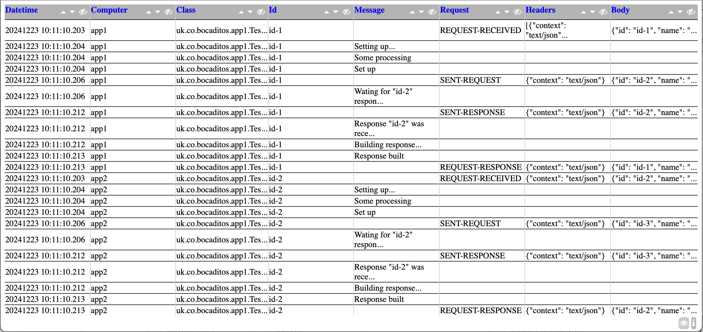

# Log to Output

[Introduction](#introduction) - [Usage](#usage) - [Development](#development) - [XLSX](#xlsx) - [HTML](#html) - [Backlog](#backlog)

---

# Introduction
A Spring Boot command line application.

It reads specified log files and convert them into a formatted output file, e.g. [HTML](#html) or 
[XLSX](#xlsx).

Formats supported are
- [HTML](#html) uses [Freemarker](https://freemarker.apache.org/index.html) library and requires [Freemarker](https://freemarker.apache.org/index.html) template, default is htmlLogs.ftl in directory templates.
- [XLSX](#xlsx) uses fastexcel library.


Each field is defined by starting character '{', to use the literal character in a log file escape 
it like '\\\\{' (without the ') and the end character is '}', which if needed to be use as part of 
the log lines then escape it, i.e. '\\\\{' (without the '). The general format is:

```
{<name>[, <type>[[, [p:<pattern>]][, [f:<format>]]|[<emun_name1>[,<enum_name>...]]]]}...
```

The '**type**' may be: **string**, **int**, **long**, **double**, **float**, **char**, **boolean**, 
**datetime**, **date**, and **enum**. By 
default it is 'string'.

If the '**type**' is '**enum**' then the following values must be valid enumeration values/names. 
Example:

```
{request, enum, REQUEST-RECEIVED, SENT-REQUEST, REQUEST-RESPONSE, SENT-RESPONSE}
```

Example of using datetime format is:

```
{datetime, datetime, f:yyyyMMdd HH:mm:ss.SSS}
```
and for date 

```
{date, date, f:yyyyMMdd}
```

When a pattern is specified the loaded field from the log lines will be verified against the pattern
and a FormatException thrown if verification fails.

Example HTML output:


---

# Usage
java \-jar Log2Xlsx-&lt;version:?.??.???&gt;.jar \-[formats](#formats) &lt;filename&gt; \-[idFieldName](#idFieldName) &lt;idFieldName&gt; \-[logs](#logs) &lt;filenames&gt; \-[out](#out) &lt;filename&gt; \[-[filter](#filter) &lt;fieldname&gt; &lt;value/from&gt; \[&lt;to&gt;\]\] \[\-[sort](#sort) &lt;field names&gt;\] \[\-[appName](#appName) &lt;name&gt;\] \[\-[workSheetVersion](#workSheetVersion) &lt;version&gt;\] \[\-[workSheetName](#workSheetName) &lt;name&gt;\] \[\-[hBorderStyle](#hBorderStyle) &lt;style&gt;\] \[\-[hFontName](#hFontName) &lt;size&gt;\] \[-[hFontSize](#hFontSize) &lt;size&gt;\] \[-[hFontColour](#hFontColour) &lt;colour&gt;\] \[\-[hFontWrapTxt](#hFontWrapTxt) &lt;wrap&gt;\] \[\-[hFontFillColuor](#hFontFillColuor) &lt;colour&gt;\] \[\-[hFontBold](#hFontBold) &lt;isBold&gt;\] \[\-[borderStyle](#borderStyle) &lt;style&gt;\] \[\-[fontName](#fontName) &lt;size&gt;\] \[\-[fontSize](#fontSize) &lt;size&gt;\] \[\-[fontColour](#fontColour) &lt;colour&gt;\] \[-[fontWrapTxt](#fontWrapTxt) &lt;wrap&gt;\] \[\-[fontFillColuor](#fontFillColuor) &lt;colour&gt;\] \[\-[fontBold](#fontBold) &lt;isBold&gt;\] \[\-[dir4template](#dir4template) &lt;dir&gt;\] \[\-[template](#template) &lt;name&gt;\] \[\-[encoding](#encoding) &lt;name&gt;\] \[\-[freemarkerVersion](#freemarkerVersion) &lt;name&gt;\] \[\-[maxCellLength](#maxCellLength) &lt;max_length&gt;\] \[\-[htmlDefaultSize](#htmlDefaultSize) &lt;size&gt;\] \[\-[htmlSize](#htmlSize) &lt;size&gt;\]

<br>
<a name="formats"></a>
 -<b>formats</b> &lt;filename&gt;
	Sets the log formats to use.

	filename
		The format filename.

```
Example:

[{datetime, datetime, f:yyyyMMdd HH:mm:ss.SSS}] \{{computer}\} [{class}] - ({id}) {request, enum, REQUEST-RECEIVED, SENT-REQUEST, REQUEST-RESPONSE, SENT-RESPONSE} \\{\"headers\": {headers}, \"payload\": {body}\\} - END
[{datetime, datetime, f:yyyyMMdd HH:mm:ss.SSS}] \{{computer}\} [{class}] - ({id}) {request, enum, REQUEST-RECEIVED, SENT-REQUEST, REQUEST-RESPONSE, SENT-RESPONSE} {message} - END
[{datetime, datetime, f:yyyyMMdd HH:mm:ss.SSS}] \{{computer}\} [{class}] - ({id}) {message}
```

<a name="idFieldName"></a>
 -<b>idFieldName</b> &lt;idFieldName&gt;
	Sets the field name to use as ID for groups.

	idFieldName
		The name of the field used as ID for groups.
<a name="logs"></a>
 -<b>logs</b> &lt;filenames&gt;
	Sets the files or directory with the log lines.

	filenames
		If a directory just one without '.' where all files ended with .log will be used
	 other wise will be considered a comma separated list of log filed.
<a name="out"></a>
 -<b>out</b> &lt;filename&gt;
	Sets the output file name.

	filename
		A filename for the output.
<a name="filter"></a>
 [-<b>filter</b> &lt;field_name&gt; &lt;value/from&gt; [&lt;to&gt;]]
 	Sets the filter of the log lines to consider.

	field_name
		The name of the field to filter against.
		
	value/from
		The value to equal to the field or is bigger or equal to.
	to
		The value to be smaller or equal to.
<a name="sort"></a>
 [-<b>sort</b> &lt;field_names&gt;]
	Sets the order of the columns based on the fields names separated by comma. The 
	field names not present will not be part of the output.

	field_names
		A list of the field names separated by comma.

[XLSX](#xlsx)<br>

<a name="appName"></a>
 [-<b>appName</b> &lt;name&gt;]
	Sets the tool name, default "Log2Xlsx".

	name
		The name of the tool.
<a name="workSheetVersion"></a>
 [-<b>workSheetVersion</b> &lt;version&gt;]
	Sets the work sheet version, default "1.0".

	version
		The worksheet version.
<a name="workSheetName"></a>
 [-<b>workSheetName</b> &lt;name&gt;]
	Sets the worksheet name "Sheet 1".

	name
		the worksheet name.

[HTML](#html)<br>

<a name="dir4template"></a>
 [-<b>dir4template</b> &lt;dir&gt;]
	Sets the template directory, default "/templates".

	dir
		the template directory.
<a name="template"></a>
 [-<b>template</b> &lt;name&gt;]
	Sets the template to create HTML, default "htmlLogs.ftl".

	name
		The name of the tool.
<a name="encoding"></a>
 [-<b>encoding</b> &lt;name&gt;]
	Sets the tool name, default "UTF-8".

	name
		The name of the tool.
<a name="freemarkerVersion"></a>
 [-<b>freemarkerVersion</b> &lt;name&gt;]
	Sets the tool name, default "2.3.34".

	name
		The name of the tool.
<a name="maxCellLength"></a>
 [-<b>maxCellLength</b> &lt;max_length&gt;]
 	Sets the maximum number of characters in a cell before truncating it and providing full text on 
 	clicking the cell text. Default value is 2147483647.

	max_length
		The max. num. of characters in a cell.
<a name="hBorderStyle"></a>
 [-<b>hBorderStyle</b> &lt;style&gt;]
	Header border style., default "THIN".

	style
		The border style.
<a name="hFontName"></a>
 [-<b>hFontName</b> &lt;size&gt;]
	Sets the header font name "Arial".

	size
		A size in pixels.
<a name="hFontSize"></a>
 [-<b>hFontSize</b> &lt;size&gt;]
	Sets the header font size "12".

	size
		a size in pixels.
<a name="hFontColour"></a>
 [-<b>hFontColour</b> &lt;colour&gt;]
	Sets the header font colour, default "#000000".

	colour
		a colour in hexadecimal, e.g. C1CDCD.
<a name="hFontWrapTxt"></a>
 [-<b>hFontWrapTxt</b> &lt;wrap&gt;]
	Sets the header fount text wrapping, default "false".

	wrap
		true to wrap the text.
<a name="hFontFillColuor"></a>
 [-<b>hFontFillColuor</b> &lt;colour&gt;]
	Sets the headers font filling colour, default "#C1CDCD".

	colour
		filling colour.
<a name="hFontBold"></a>
 [-<b>hFontBold</b> &lt;isBold&gt;]
	Sets the headers font to bold.

	isBold
		true if the headers must be in bold font.
<a name="borderStyle"></a>
 [-<b>borderStyle</b> &lt;style&gt;]
	Header border style, default "THIN".

	style
		The border style.
<a name="fontName"></a>
 [-<b>fontName</b> &lt;size&gt;]
	Sets the header font name "Arial".

	size
		A size in pixels.
<a name="fontSize"></a>
 [-<b>fontSize</b> &lt;size&gt;]
	Sets the header font size "12".

	size
		a size in pixels.
<a name="fontColour"></a>
 [-<b>fontColour</b> &lt;colour&gt;\]
	Sets the header font colour, default "#000000".

	colour
		a colour in hexadecimal, e.g. C1CDCD.
<a name="fontWrapTxt"></a>
 [-<b>fontWrapTxt</b> &lt;wrap&gt;]
	Sets the header fount text wrapping, default "false".

	wrap
		true to wrap the text.
<a name="fontFillColuor"></a>
 [-<b>fontFillColuor</b> &lt;colour&gt;]
	Sets the font filling colour, default "#FFFFFF".

	colour
		filling colour.
<a name="fontBold"></a>
 [-<b>fontBold</b> &lt;isBold&gt;]
	Sets the rows font to bold.

	isBold
		true if the rows must be in bold font.
<a name="htmlDefaultSize"></a>
 [-<b>htmlDefaultSize</b> &lt;size&gt;]
	Sets the table default column size, default "auto".

	size
		A size, e.g. 150px.
<a name="htmlSize"></a>
 [-<b>htmlSize</b> &lt;size&gt;]
	&lt;name&gt; Sets the table column size.

	size
		A size, e.g. 150px.

---

# Development
Spring Boot (Command Line) application.

---

# XLSX
Example of HTML result from log lines can be seen at [testOut.xlsx](testOut_.xlsx).

---

# HTML
Example of HTML result from log lines can be seen at [testOut.html](testOut_.html).

---

# Backlog

- 

---

[Introduction](#introduction) - [Development](#development) - [Usage](#usage) - [XLSX](#xlsx) - [HTML](#html) - [Backlog](#backlog)

---